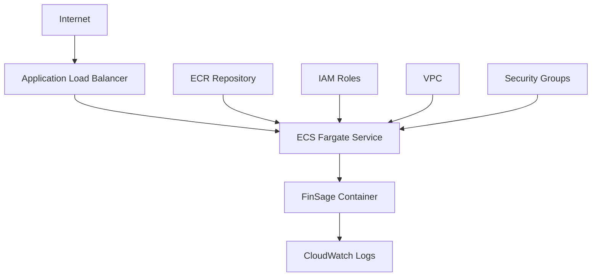

# FinSage AWS Deployment Guide
## Production-Ready Deployment for Full-Stack Developers

---

## 🎯 **Why AWS for Your Resume?**

### **Industry Value:**
- **90% of companies** use AWS for production applications
- **$200K+ salaries** for AWS-certified developers
- **Scalable infrastructure** that grows with your career
- **Real-world experience** with enterprise-grade systems

### **Skills You'll Learn:**
- ✅ **ECS (Elastic Container Service)** - Container orchestration
- ✅ **ECR (Elastic Container Registry)** - Docker image storage
- ✅ **Application Load Balancer** - Traffic distribution
- ✅ **CloudWatch** - Monitoring and logging
- ✅ **IAM** - Security and permissions
- ✅ **VPC** - Network configuration

---

## 🏗️ **AWS Architecture Overview**



---

## 🚀 **Step-by-Step AWS Deployment**

### **Prerequisites Setup**

1. **AWS Account Setup**
   - Go to https://aws.amazon.com
   - Create free account (12 months free tier)
   - Enable billing alerts ($5 limit)

2. **Install AWS CLI**
   ```bash
   # macOS
   curl "https://awscli.amazonaws.com/AWSCLIV2.pkg" -o "AWSCLIV2.pkg"
   sudo installer -pkg AWSCLIV2.pkg -target /
   
   # Verify installation
   aws --version
   ```

3. **Configure AWS CLI**
   ```bash
   aws configure
   # Enter your Access Key ID
   # Enter your Secret Access Key
   # Default region: us-east-1
   # Default output format: json
   ```

### **Method 1: Automated Deployment (Recommended)**

**Run the deployment script:**
```bash
./aws-deploy.sh
```

This script will:
- Create ECR repository
- Build and push Docker image
- Create ECS cluster and service
- Set up CloudWatch logging
- Deploy your application

### **Method 2: Manual AWS Console Deployment**

#### **Step 1: Create ECR Repository**
1. Go to AWS Console → ECR
2. Click "Create repository"
3. Name: `finsage`
4. Click "Create repository"

#### **Step 2: Build and Push Docker Image**
```bash
# Get ECR login token
aws ecr get-login-password --region us-east-1 | docker login --username AWS --password-stdin YOUR_ACCOUNT_ID.dkr.ecr.us-east-1.amazonaws.com

# Build image
docker build -t finsage .

# Tag image
docker tag finsage:latest YOUR_ACCOUNT_ID.dkr.ecr.us-east-1.amazonaws.com/finsage:latest

# Push image
docker push YOUR_ACCOUNT_ID.dkr.ecr.us-east-1.amazonaws.com/finsage:latest
```

#### **Step 3: Create ECS Cluster**
1. Go to AWS Console → ECS
2. Click "Create Cluster"
3. Name: `finsage-cluster`
4. Select "Fargate" (serverless)
5. Click "Create"

#### **Step 4: Create Task Definition**
1. Go to ECS → Task Definitions
2. Click "Create new Task Definition"
3. Name: `finsage-task`
4. Select "Fargate"
5. CPU: 0.25 vCPU, Memory: 0.5 GB
6. Container Definition:
   - Name: `finsage`
   - Image: `YOUR_ACCOUNT_ID.dkr.ecr.us-east-1.amazonaws.com/finsage:latest`
   - Port: 8000
   - Protocol: TCP

#### **Step 5: Create ECS Service**
1. Go to your cluster
2. Click "Create Service"
3. Task Definition: `finsage-task`
4. Service name: `finsage-service`
5. Number of tasks: 1
6. Enable "Public IP"
7. Create service

#### **Step 6: Create Application Load Balancer**
1. Go to EC2 → Load Balancers
2. Click "Create Load Balancer"
3. Select "Application Load Balancer"
4. Name: `finsage-alb`
5. Scheme: Internet-facing
6. Listeners: HTTP:80, HTTPS:443
7. Create target group for ECS service

---

## 💰 **Cost Estimation**

### **Free Tier (12 months):**
- **ECS Fargate**: 20 GB-hours/month free
- **ECR**: 500 MB storage free
- **Application Load Balancer**: 750 hours free
- **CloudWatch**: 5 GB logs free
- **Data Transfer**: 1 GB free

### **After Free Tier:**
- **ECS Fargate**: ~$5-10/month
- **ALB**: ~$16/month
- **ECR**: ~$1/month
- **Total**: ~$22-27/month

---

## 🔧 **Advanced AWS Features**

### **Auto Scaling**
```json
{
  "minCapacity": 1,
  "maxCapacity": 10,
  "targetValue": 70.0,
  "scaleInCooldown": 300,
  "scaleOutCooldown": 300
}
```

### **Custom Domain**
1. Route 53 for DNS
2. ACM for SSL certificates
3. CloudFront for CDN

### **Database Integration**
- **RDS PostgreSQL** for persistent data
- **DynamoDB** for NoSQL needs
- **ElastiCache** for caching

---

## 📊 **Monitoring & Logging**

### **CloudWatch Dashboard**
- CPU and memory utilization
- Request count and latency
- Error rates and response times

### **Alarms**
- High CPU usage (>80%)
- High memory usage (>90%)
- Error rate (>5%)

---

## 🚨 **Troubleshooting**

### **Common Issues:**

1. **Container won't start**
   - Check CloudWatch logs
   - Verify port configuration
   - Check security groups

2. **Can't access application**
   - Verify ALB target group health
   - Check security group rules
   - Confirm public IP assignment

3. **High costs**
   - Use Spot instances
   - Implement auto-scaling
   - Monitor usage patterns

---

## 🎯 **Resume-Worthy Achievements**

After deployment, you can add to your resume:

**"Deployed FinSage financial platform on AWS using:**
- **ECS Fargate** for containerized application hosting
- **ECR** for Docker image management
- **Application Load Balancer** for traffic distribution
- **CloudWatch** for monitoring and logging
- **IAM** for security and access management
- **VPC** for network isolation and security"

---

## 🔗 **Useful AWS Resources**

- **AWS Free Tier**: https://aws.amazon.com/free/
- **ECS Documentation**: https://docs.aws.amazon.com/ecs/
- **ECR Documentation**: https://docs.aws.amazon.com/ecr/
- **AWS CLI Reference**: https://docs.aws.amazon.com/cli/

---

**Ready to deploy? Start with the automated script: `./aws-deploy.sh`** 🚀
