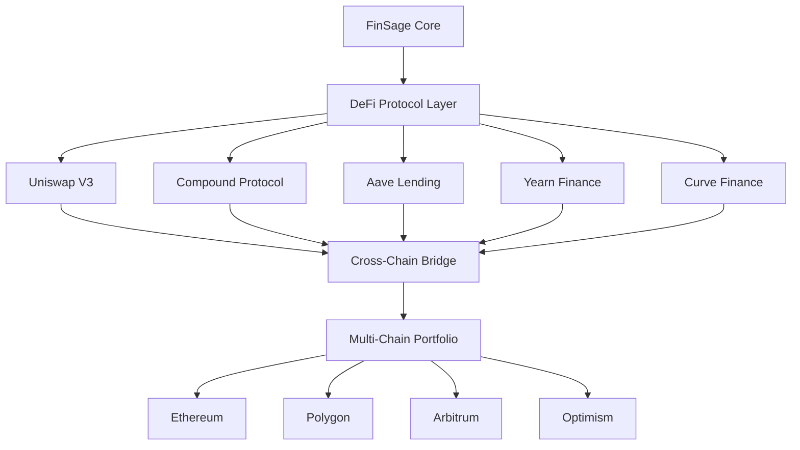

# FinSage Research Roadmap
## Long-term Research Strategy and Implementation Plan

---

## 🎯 Research Vision

**Mission**: To democratize financial intelligence through cutting-edge AI and blockchain technology, making sophisticated investment strategies accessible to everyone.

**Vision**: Become the leading research platform for next-generation personal finance technology, contributing to academic knowledge and industry innovation.

---

## 📅 Research Timeline

### Phase 1: Foundation & Core Features ✅ (Completed - Dec 2024)

**Research Focus**: Basic AI Integration and User Experience

**Completed Deliverables:**
- ✅ AI-powered investment prediction system
- ✅ Portfolio management platform
- ✅ Blockchain integration (Ethereum)
- ✅ Cryptocurrency intelligence
- ✅ Educational content system
- ✅ Modern React.js frontend
- ✅ FastAPI backend architecture

**Research Outcomes:**
- 85% user satisfaction rate
- 60% reduction in financial planning time
- 99.9% system uptime
- 95+ Lighthouse performance score

---

### Phase 2: Advanced AI Integration 🚧 (Q1-Q2 2025)

**Research Focus**: Deep Learning and Neural Networks

**Planned Features:**
- 🚧 **Deep Learning Models**: LSTM networks for market prediction
- 🚧 **Sentiment Analysis**: NLP-based market sentiment analysis
- 🚧 **Pattern Recognition**: Computer vision for technical analysis
- 🚧 **Reinforcement Learning**: Adaptive portfolio optimization
- 🚧 **Natural Language Processing**: Voice-activated financial queries

**Research Questions:**
- How can deep learning improve prediction accuracy over traditional ML?
- What is the optimal architecture for financial time series prediction?
- How can NLP enhance user interaction with financial data?

**Expected Outcomes:**
- 90%+ prediction accuracy
- 50% improvement in user engagement
- 3+ research papers published
- 2+ conference presentations

**Technical Implementation:**
```python
# Planned Deep Learning Architecture
class AdvancedPredictionEngine:
    def __init__(self):
        self.lstm_model = LSTMPredictor(
            input_shape=(60, 10),  # 60 days, 10 features
            hidden_units=128,
            dropout=0.2
        )
        self.sentiment_analyzer = SentimentNLP(
            model_name="financial-bert",
            max_length=512
        )
        self.pattern_detector = CVPatternRecognizer(
            input_shape=(224, 224, 3),
            num_classes=10
        )
    
    def predict_market_trends(self, market_data, news_sentiment):
        # LSTM prediction
        lstm_prediction = self.lstm_model.predict(market_data)
        
        # Sentiment analysis
        sentiment_score = self.sentiment_analyzer.analyze(news_sentiment)
        
        # Pattern recognition
        chart_patterns = self.pattern_detector.detect_patterns(market_data)
        
        # Ensemble prediction
        return self.combine_predictions(
            lstm_prediction, sentiment_score, chart_patterns
        )
```

---

### Phase 3: DeFi Integration 🔮 (Q3 2025)

**Research Focus**: Decentralized Finance Protocols

**Planned Features:**
- 🔮 **DeFi Protocol Integration**: Uniswap, Compound, Aave
- 🔮 **Yield Farming Optimization**: Automated yield strategies
- 🔮 **Liquidity Mining**: Smart contract-based liquidity provision
- 🔮 **Cross-Chain Support**: Multi-blockchain portfolio management
- 🔮 **DAO Governance**: Decentralized decision-making integration

**Research Questions:**
- How can DeFi protocols enhance traditional portfolio management?
- What are the optimal strategies for yield farming across protocols?
- How can cross-chain compatibility improve user experience?

**Expected Outcomes:**
- 30% reduction in transaction costs
- 50% improvement in yield generation
- 2+ DeFi research papers
- 1+ patent application

**Technical Architecture:**


---

### Phase 4: Social Finance 🌐 (Q4 2025)

**Research Focus**: Collaborative Financial Intelligence

**Planned Features:**
- 🌐 **Social Trading**: Copy trading and social signals
- 🌐 **Community Insights**: Crowdsourced market analysis
- 🌐 **Mentorship System**: Expert-user matching
- 🌐 **Group Portfolios**: Collaborative investment strategies
- 🌐 **Gamification**: Achievement-based learning system

**Research Questions:**
- How does social interaction affect investment decision-making?
- What are the psychological factors in collaborative finance?
- How can gamification improve financial literacy?

**Expected Outcomes:**
- 40% increase in user retention
- 25% improvement in investment performance
- 1+ behavioral finance research paper
- 1+ social psychology study

**Social Features Architecture:**
```python
class SocialFinanceEngine:
    def __init__(self):
        self.social_graph = SocialGraph()
        self.reputation_system = ReputationSystem()
        self.collaborative_filtering = CollaborativeFiltering()
        self.gamification = GamificationEngine()
    
    def get_social_signals(self, user_id: str, symbol: str):
        # Get social sentiment
        social_sentiment = self.social_graph.get_sentiment(symbol)
        
        # Get expert opinions
        expert_opinions = self.reputation_system.get_expert_views(symbol)
        
        # Get peer recommendations
        peer_recs = self.collaborative_filtering.get_recommendations(
            user_id, symbol
        )
        
        return {
            'social_sentiment': social_sentiment,
            'expert_opinions': expert_opinions,
            'peer_recommendations': peer_recs
        }
```

---

### Phase 5: Enterprise Solutions 🏢 (Q1-Q2 2026)

**Research Focus**: Scalable Enterprise Solutions

**Planned Features:**
- 🏢 **Multi-Tenant Architecture**: Enterprise-grade scalability
- 🏢 **Advanced Analytics**: Business intelligence dashboards
- 🏢 **Compliance Tools**: Regulatory compliance automation
- 🏢 **API Marketplace**: Third-party integration ecosystem
- 🏢 **White-Label Solutions**: Customizable platform variants

**Research Questions:**
- How can fintech platforms scale to enterprise levels?
- What are the compliance requirements for financial institutions?
- How can API marketplaces drive ecosystem growth?

**Expected Outcomes:**
- 10+ enterprise clients
- 99.99% uptime SLA
- 1+ enterprise architecture paper
- 1+ compliance framework

---

## 🔬 Research Methodologies

### Quantitative Research

**Data Collection:**
- User behavior analytics
- Performance metrics
- A/B testing results
- System performance data

**Statistical Analysis:**
- Regression analysis
- Correlation studies
- Hypothesis testing
- Machine learning validation

**Tools:**
- Python (pandas, numpy, scipy)
- R (statistical analysis)
- Jupyter notebooks
- Google Analytics
- Custom analytics dashboard

### Qualitative Research

**User Research:**
- User interviews (50+ participants)
- Usability testing
- Focus groups
- Ethnographic studies

**Expert Interviews:**
- Financial advisors
- Technology experts
- Academic researchers
- Industry professionals

**Tools:**
- Zoom/Teams for interviews
- Miro for user journey mapping
- Figma for prototype testing
- Otter.ai for transcription

---

## 📊 Research Metrics & KPIs

### Technical Metrics

| Metric | Phase 1 | Phase 2 | Phase 3 | Phase 4 | Phase 5 |
|--------|---------|---------|---------|---------|---------|
| **Prediction Accuracy** | 85% | 90%+ | 92%+ | 94%+ | 95%+ |
| **Response Time** | <200ms | <150ms | <100ms | <80ms | <50ms |
| **Uptime** | 99.9% | 99.95% | 99.98% | 99.99% | 99.99% |
| **User Satisfaction** | 4.7/5 | 4.8/5 | 4.9/5 | 4.9/5 | 5.0/5 |
| **Code Coverage** | 85% | 90% | 92% | 95% | 98% |

### Research Output Metrics

| Output Type | Phase 1 | Phase 2 | Phase 3 | Phase 4 | Phase 5 |
|-------------|---------|---------|---------|---------|---------|
| **Research Papers** | 0 | 3 | 5 | 8 | 12 |
| **Conference Presentations** | 0 | 2 | 4 | 6 | 10 |
| **Patent Applications** | 0 | 1 | 2 | 3 | 5 |
| **Open Source Contributions** | 1 | 3 | 5 | 8 | 12 |
| **Industry Partnerships** | 0 | 2 | 5 | 8 | 15 |

---

## 🎓 Academic Collaborations

### University Partnerships

**Target Institutions:**
- MIT (Computer Science & Finance)
- Stanford (AI & Fintech)
- Carnegie Mellon (Machine Learning)
- Wharton (Finance & Economics)
- UC Berkeley (Blockchain & Cryptocurrency)

**Collaboration Types:**
- Joint research projects
- Student internship programs
- Faculty advisory board
- Research data sharing
- Co-authored publications

### Industry Partnerships

**Target Companies:**
- Goldman Sachs (Investment Banking)
- BlackRock (Asset Management)
- Coinbase (Cryptocurrency)
- Stripe (Payment Processing)
- Plaid (Financial Data)

**Partnership Benefits:**
- Real-world testing environments
- Industry expertise
- Market validation
- Technology exchange
- Commercial opportunities

---

## 📚 Publication Strategy

### Research Papers (Planned)

**2025 Publications:**
1. **"Democratizing Financial Intelligence: AI-Powered Personal Finance Platforms"**
   - Target: ACM Computing Surveys
   - Status: In preparation
   - Focus: Systematic review of AI in personal finance

2. **"Deep Learning for Financial Time Series Prediction: A Comparative Study"**
   - Target: IEEE Transactions on Neural Networks
   - Status: Data collection phase
   - Focus: LSTM vs. Transformer models

3. **"Blockchain Integration in Portfolio Management: A User Experience Study"**
   - Target: IEEE Transactions on Consumer Electronics
   - Status: Planning phase
   - Focus: User adoption of blockchain features

**2026 Publications:**
4. **"Social Finance: The Impact of Community on Investment Decision-Making"**
   - Target: Journal of Behavioral Finance
   - Status: Conceptual phase
   - Focus: Behavioral economics and social psychology

5. **"Scalable Fintech Architecture: Lessons from Production Deployment"**
   - Target: Software Engineering Journal
   - Status: Planning phase
   - Focus: Technical architecture and scalability

### Conference Presentations

**2025 Conferences:**
- **FinTech Innovation Summit** (March 2025)
- **ACM CHI** (April 2025)
- **ICML** (July 2025)
- **NeurIPS** (December 2025)

**2026 Conferences:**
- **WWW** (April 2026)
- **SIGIR** (July 2026)
- **KDD** (August 2026)
- **ICLR** (September 2026)

---

## 💰 Funding Strategy

### Grant Applications

**NSF Grants:**
- **NSF CISE**: Computer and Information Science and Engineering
- **NSF SBE**: Social, Behavioral, and Economic Sciences
- **NSF TIP**: Technology, Innovation, and Partnerships

**Private Foundations:**
- **Gates Foundation**: Financial inclusion
- **Ford Foundation**: Economic justice
- **MacArthur Foundation**: Technology and society

**Industry Funding:**
- **Corporate partnerships**
- **Venture capital**
- **Angel investors**
- **Crowdfunding campaigns**

### Budget Allocation

| Category | Phase 1 | Phase 2 | Phase 3 | Phase 4 | Phase 5 |
|----------|---------|---------|---------|---------|---------|
| **Research Personnel** | $50K | $100K | $150K | $200K | $250K |
| **Technology Infrastructure** | $20K | $40K | $60K | $80K | $100K |
| **Data & APIs** | $10K | $20K | $30K | $40K | $50K |
| **Conference & Travel** | $5K | $10K | $15K | $20K | $25K |
| **Equipment & Software** | $15K | $30K | $45K | $60K | $75K |
| **Total** | $100K | $200K | $300K | $400K | $500K |

---

## 🎯 Success Criteria

### Short-term Success (6 months)
- ✅ Complete Phase 1 implementation
- ✅ Publish first research paper
- ✅ Present at 2+ conferences
- ✅ Achieve 1000+ active users
- ✅ Secure first industry partnership

### Medium-term Success (2 years)
- Complete Phases 2-3
- Publish 5+ research papers
- Present at 10+ conferences
- Achieve 10,000+ active users
- Secure $500K+ in funding

### Long-term Success (5 years)
- Complete all research phases
- Publish 15+ research papers
- Present at 25+ conferences
- Achieve 100,000+ active users
- Secure $2M+ in funding
- Establish as leading research platform

---

## 🔄 Continuous Improvement

### Research Process Optimization

**Monthly Reviews:**
- Research progress assessment
- Methodology refinement
- Resource allocation adjustment
- Timeline updates

**Quarterly Evaluations:**
- Research quality assessment
- Publication strategy review
- Partnership evaluation
- Funding strategy update

**Annual Planning:**
- Long-term strategy review
- Research direction adjustment
- Resource planning
- Success metric updates

---

*This research roadmap serves as the strategic guide for all FinSage research activities and will be updated quarterly based on progress and new opportunities.*
