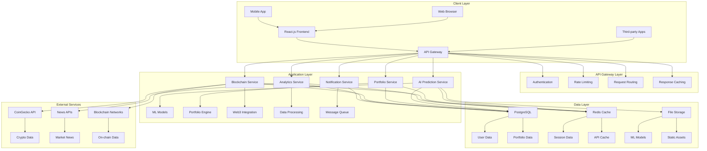
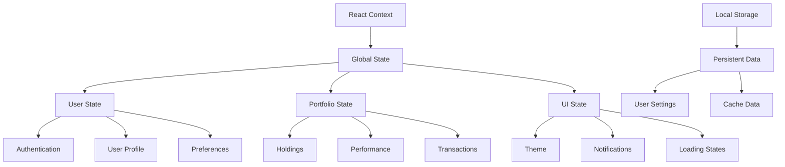
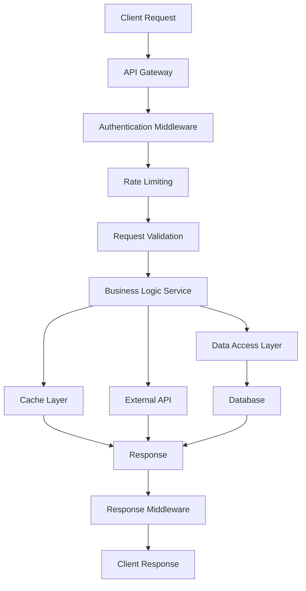
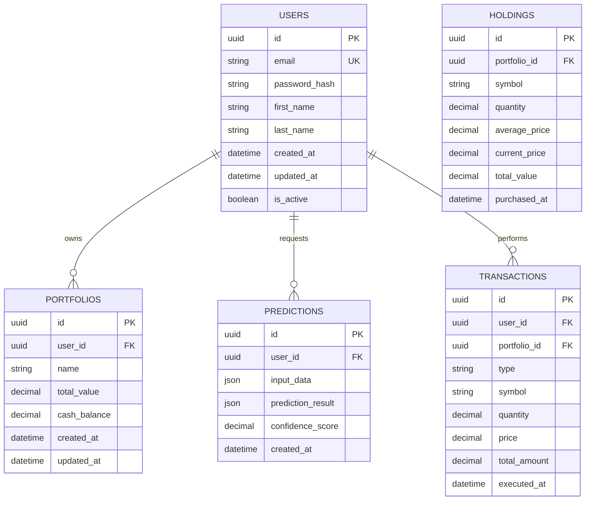
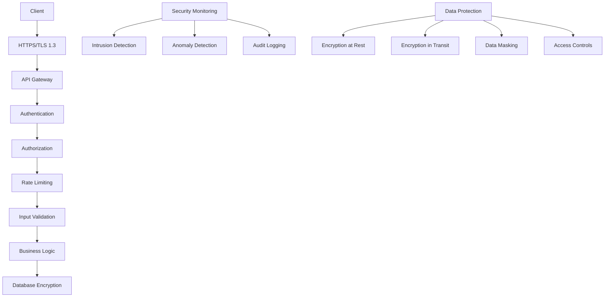
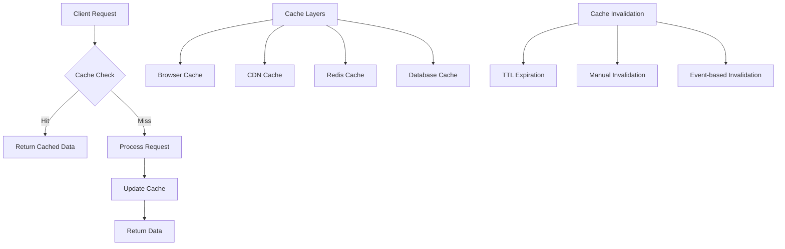
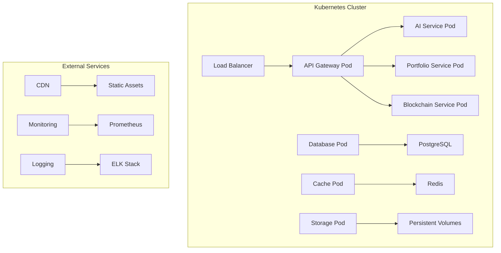
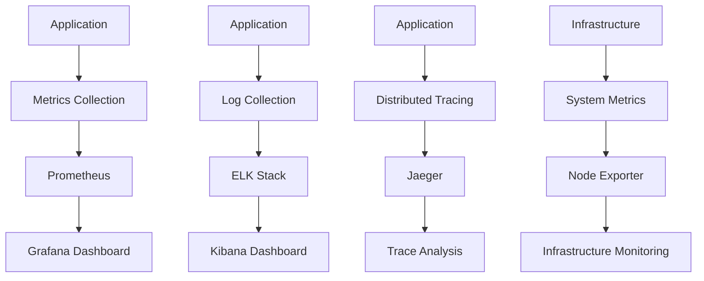

# FinSage Technical Architecture
## Comprehensive System Design Documentation

---

## 🏗️ System Architecture Overview

### High-Level Architecture



---

## 🖥️ Frontend Architecture

### React.js Component Structure

```
src/
├── components/                 # Reusable UI components
│   ├── common/               # Generic components
│   │   ├── Button.jsx
│   │   ├── Modal.jsx
│   │   ├── LoadingSpinner.jsx
│   │   └── ErrorBoundary.jsx
│   ├── forms/                # Form components
│   │   ├── PredictionForm.jsx
│   │   ├── PortfolioForm.jsx
│   │   └── UserProfileForm.jsx
│   ├── charts/               # Data visualization
│   │   ├── PortfolioChart.jsx
│   │   ├── PerformanceChart.jsx
│   │   └── RiskChart.jsx
│   └── layout/               # Layout components
│       ├── Header.jsx
│       ├── Sidebar.jsx
│       └── Footer.jsx
├── pages/                    # Page components
│   ├── Dashboard.jsx
│   ├── Predictions.jsx
│   ├── Portfolio.jsx
│   ├── Analytics.jsx
│   └── Settings.jsx
├── hooks/                    # Custom React hooks
│   ├── useApi.js
│   ├── useAuth.js
│   └── usePortfolio.js
├── services/                 # API services
│   ├── api.js
│   ├── authService.js
│   └── portfolioService.js
├── utils/                    # Utility functions
│   ├── formatters.js
│   ├── validators.js
│   └── constants.js
└── styles/                   # Styling
    ├── globals.css
    ├── components.css
    └── themes.css
```

### State Management Architecture



---

## ⚙️ Backend Architecture

### Microservices Structure

```
backend/
├── app/
│   ├── core/                 # Core configuration
│   │   ├── config.py        # Environment configuration
│   │   ├── logger.py        # Logging setup
│   │   └── security.py      # Security utilities
│   ├── models/              # Data models
│   │   ├── schemas.py       # Pydantic schemas
│   │   ├── database.py      # Database models
│   │   └── enums.py         # Enumeration types
│   ├── services/            # Business logic
│   │   ├── ai_service.py    # AI/ML services
│   │   ├── portfolio_service.py
│   │   ├── blockchain_service.py
│   │   └── analytics_service.py
│   ├── routes/              # API routes
│   │   ├── auth.py          # Authentication routes
│   │   ├── predictions.py   # AI prediction routes
│   │   ├── portfolio.py     # Portfolio routes
│   │   └── blockchain.py    # Blockchain routes
│   ├── utils/               # Utility functions
│   │   ├── helpers.py       # General helpers
│   │   ├── validators.py    # Input validation
│   │   └── formatters.py    # Data formatting
│   └── main.py              # FastAPI application
├── tests/                   # Test suite
│   ├── unit/               # Unit tests
│   ├── integration/        # Integration tests
│   └── e2e/                # End-to-end tests
├── models/                 # ML model files
│   ├── prediction_model.pkl
│   ├── risk_model.pkl
│   └── sentiment_model.pkl
└── contracts/              # Smart contract ABIs
    ├── erc20.json
    └── uniswap.json
```

### API Design Patterns



---

## 🗄️ Database Design

### Entity Relationship Diagram



### Database Schema

```sql
-- Users table
CREATE TABLE users (
    id UUID PRIMARY KEY DEFAULT gen_random_uuid(),
    email VARCHAR(255) UNIQUE NOT NULL,
    password_hash VARCHAR(255) NOT NULL,
    first_name VARCHAR(100),
    last_name VARCHAR(100),
    created_at TIMESTAMP DEFAULT CURRENT_TIMESTAMP,
    updated_at TIMESTAMP DEFAULT CURRENT_TIMESTAMP,
    is_active BOOLEAN DEFAULT TRUE
);

-- Portfolios table
CREATE TABLE portfolios (
    id UUID PRIMARY KEY DEFAULT gen_random_uuid(),
    user_id UUID REFERENCES users(id) ON DELETE CASCADE,
    name VARCHAR(255) NOT NULL,
    total_value DECIMAL(15,2) DEFAULT 0,
    cash_balance DECIMAL(15,2) DEFAULT 0,
    created_at TIMESTAMP DEFAULT CURRENT_TIMESTAMP,
    updated_at TIMESTAMP DEFAULT CURRENT_TIMESTAMP
);

-- Holdings table
CREATE TABLE holdings (
    id UUID PRIMARY KEY DEFAULT gen_random_uuid(),
    portfolio_id UUID REFERENCES portfolios(id) ON DELETE CASCADE,
    symbol VARCHAR(20) NOT NULL,
    quantity DECIMAL(15,8) NOT NULL,
    average_price DECIMAL(15,2) NOT NULL,
    current_price DECIMAL(15,2),
    total_value DECIMAL(15,2),
    purchased_at TIMESTAMP DEFAULT CURRENT_TIMESTAMP
);

-- Predictions table
CREATE TABLE predictions (
    id UUID PRIMARY KEY DEFAULT gen_random_uuid(),
    user_id UUID REFERENCES users(id) ON DELETE CASCADE,
    input_data JSONB NOT NULL,
    prediction_result JSONB NOT NULL,
    confidence_score DECIMAL(5,2),
    created_at TIMESTAMP DEFAULT CURRENT_TIMESTAMP
);

-- Transactions table
CREATE TABLE transactions (
    id UUID PRIMARY KEY DEFAULT gen_random_uuid(),
    user_id UUID REFERENCES users(id) ON DELETE CASCADE,
    portfolio_id UUID REFERENCES portfolios(id) ON DELETE CASCADE,
    type VARCHAR(20) NOT NULL, -- 'buy', 'sell', 'deposit', 'withdrawal'
    symbol VARCHAR(20),
    quantity DECIMAL(15,8),
    price DECIMAL(15,2),
    total_amount DECIMAL(15,2) NOT NULL,
    executed_at TIMESTAMP DEFAULT CURRENT_TIMESTAMP
);
```

---

## 🔐 Security Architecture

### Security Layers



### Security Implementation

**Authentication & Authorization:**
```python
# JWT Token Implementation
class AuthService:
    def __init__(self):
        self.secret_key = os.getenv("JWT_SECRET_KEY")
        self.algorithm = "HS256"
        self.access_token_expire = timedelta(minutes=30)
        self.refresh_token_expire = timedelta(days=7)
    
    def create_access_token(self, user_id: str) -> str:
        payload = {
            "user_id": user_id,
            "exp": datetime.utcnow() + self.access_token_expire,
            "iat": datetime.utcnow(),
            "type": "access"
        }
        return jwt.encode(payload, self.secret_key, algorithm=self.algorithm)
    
    def verify_token(self, token: str) -> dict:
        try:
            payload = jwt.decode(token, self.secret_key, algorithms=[self.algorithm])
            return payload
        except jwt.ExpiredSignatureError:
            raise HTTPException(status_code=401, detail="Token expired")
        except jwt.InvalidTokenError:
            raise HTTPException(status_code=401, detail="Invalid token")
```

**Data Encryption:**
```python
# Data Encryption Service
class EncryptionService:
    def __init__(self):
        self.key = Fernet.generate_key()
        self.cipher = Fernet(self.key)
    
    def encrypt_sensitive_data(self, data: str) -> str:
        return self.cipher.encrypt(data.encode()).decode()
    
    def decrypt_sensitive_data(self, encrypted_data: str) -> str:
        return self.cipher.decrypt(encrypted_data.encode()).decode()
```

---

## 📊 Performance Architecture

### Caching Strategy



### Performance Optimization

**Database Optimization:**
```sql
-- Indexes for performance
CREATE INDEX idx_users_email ON users(email);
CREATE INDEX idx_portfolios_user_id ON portfolios(user_id);
CREATE INDEX idx_holdings_portfolio_id ON holdings(portfolio_id);
CREATE INDEX idx_transactions_user_id ON transactions(user_id);
CREATE INDEX idx_transactions_executed_at ON transactions(executed_at);

-- Partitioning for large tables
CREATE TABLE transactions_2024 PARTITION OF transactions
FOR VALUES FROM ('2024-01-01') TO ('2025-01-01');
```

**API Response Caching:**
```python
# Redis Caching Implementation
class CacheService:
    def __init__(self):
        self.redis_client = redis.Redis(host='localhost', port=6379, db=0)
        self.default_ttl = 300  # 5 minutes
    
    def get_cached_data(self, key: str) -> Optional[dict]:
        cached_data = self.redis_client.get(key)
        if cached_data:
            return json.loads(cached_data)
        return None
    
    def set_cached_data(self, key: str, data: dict, ttl: int = None) -> bool:
        ttl = ttl or self.default_ttl
        return self.redis_client.setex(
            key, ttl, json.dumps(data, default=str)
        )
```

---

## 🚀 Deployment Architecture

### Container Orchestration



### Docker Configuration

```dockerfile
# Frontend Dockerfile
FROM node:18-alpine AS builder
WORKDIR /app
COPY package*.json ./
RUN npm ci --only=production
COPY . .
RUN npm run build

FROM nginx:alpine
COPY --from=builder /app/build /usr/share/nginx/html
COPY nginx.conf /etc/nginx/nginx.conf
EXPOSE 80
CMD ["nginx", "-g", "daemon off;"]
```

```dockerfile
# Backend Dockerfile
FROM python:3.9-slim
WORKDIR /app
COPY requirements.txt .
RUN pip install --no-cache-dir -r requirements.txt
COPY . .
EXPOSE 8000
CMD ["uvicorn", "app.main:app", "--host", "0.0.0.0", "--port", "8000"]
```

---

## 📈 Monitoring & Observability

### Monitoring Stack



### Key Metrics

**Application Metrics:**
- Request rate and latency
- Error rate and status codes
- Database connection pool usage
- Cache hit/miss ratios
- AI model prediction accuracy

**Infrastructure Metrics:**
- CPU and memory usage
- Disk I/O and network traffic
- Database performance
- Cache performance
- External API response times

**Business Metrics:**
- User engagement rates
- Feature adoption rates
- Revenue per user
- Customer satisfaction scores
- Support ticket volume

---

*This technical architecture document provides a comprehensive overview of the FinSage system design and will be updated as the platform evolves.*
